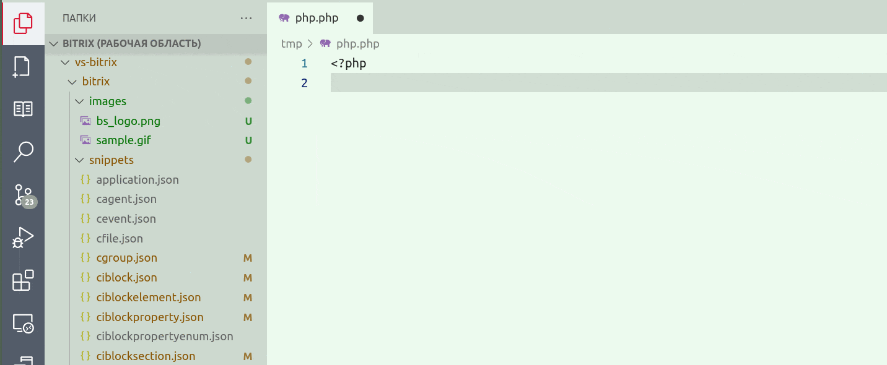

# Bitrix snippets

Сниппеты Bitrix для VS Code Editor

Расширение устанавливается глобально и не требует установки в рабочую область.

*в примере использована тема [Green Paper](https://marketplace.visualstudio.com/items?itemName=Suntechnic.green-papper)*

## Использование

Просто начните набирать что-нибудь типа CIBlock и нажмите Enter.
Шорткаты сниппетов совместимы с [Bitrix Snippet by Sumanai](https://marketplace.visualstudio.com/items?itemName=sumanai.bitrix-snippet)
Используйте префикс d7 для использования нового [D7 API](https://dev.1c-bitrix.ru/api_d7/).
Используйте префикс bx для общих сниппетов, такие как подключение пролога.

## Форматирование кода

Форматирование кода внутри сниппетов опирается на следующие соглашение:

### Переменные

#### Префиксы переменных

Переменные хранящие обычные значения такие как целые и строки начинаются с заглавной буквы и именуются в CamelCase. Например $Id, $Price и т.д.

Массивы имеют префиксы:  
- $lst* - список однородных элементов, порядок которых не важен, например список элементов ИБ
- $ul* - упорядоченный список однородных элементов, например навигационная цепочка разделов
- $dct* - массив представляющий собой разнородные элементы, например поля и свойства элемента ИБ
- $ref* - справочник однородных элементов, например список элементов ИБ ключами которого являются их ID
- $ar* - массивы используемые в штатном движке компонентов Bitrix и со стандартными компонентами. Например $arFilter для компонента bitrix:catalog.element, но $dctFilter для функции API ядра.

Объекты именуются с маленькой буквы, в lowerCamelCase и могу иметь префексы:
- $rdb* - итерируемый результат выборки из бд, например $rdbPrice = \Bitrix\Catalog\Model\Price::getList($dctFilter);

Неиспользуемая переменная $_. 
Например для перебора ключей foreach ($ref as $Key=>$_).

#### Имена переменных

- *Element - элемент инфоблока, например $lstElements или $dctElement
- *Product - товар, элемент торгового каталога, имеющий цену, когда не важно идет ли речь об обычном товаре или торговом предложении
- *Offer - торговое предложение
- *Good - товар имеющий торговые предложения

#### Коды сущностей

Предполагается, что символьные коды информационных блоков, свойств элементов ИБ и т.п. именуются исключительно латинскими буквами и цифрами. Символ подчеркивания используется только как технический разделитель, но не для целей читаемости. Например FULLNAME (но не FULL_NAME) для полного название элемента. Однако FULLNAME_RU и FULLNAME_UA, для версий полного названия на русском и украинском языках, соответственно.